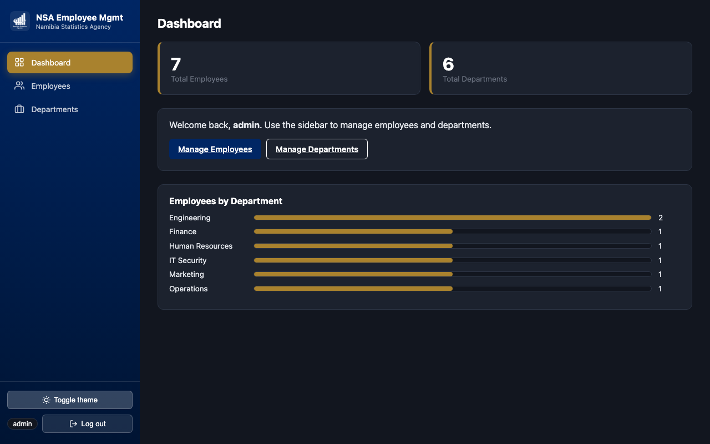
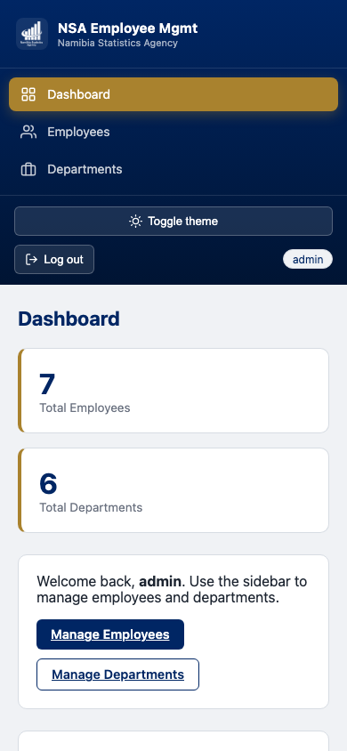

# NSA Employee Management System

A simple Employee Management System built for Section B (Practical) of the assessment: login, full Employee CRUD, full Department CRUD, a SQL database with proper foreign-key relationships, and a responsive UI matching the Namibia Statistics Agency (NSA) brand.

## Screenshots

| Login | Dashboard |
|---|---|
|  |  |

| Employees | Employee detail |
|---|---|
|  |  |

| Departments | Dark mode |
|---|---|
|  |  |

| Mobile / responsive |
|---|
|  |

## Section A

_Not included in this submission — the Section A question sheet was not available when this project was built. Please add your Section A answers to this section before submitting._

## Project Setup Steps

**Requirements:** Node.js 22+ (uses the built-in `node:sqlite` module — no separate database server to install).

```bash
npm install
npm start
```

Then open **http://localhost:3000** in your browser. The SQLite database (`ems.db`) is created and auto-seeded with sample departments/employees on first run.

To run the unit tests:

```bash
npm test
```

## Login Credentials

| Username | Password  |
|----------|-----------|
| `admin`  | `admin123` |

The user is seeded into a `users` table in SQLite on first run (see `db.js`), satisfying the "store it in your database" option rather than a purely hardcoded check.

## How to Use

1. **Log in** at `http://localhost:3000` with the credentials above. You're redirected to the dashboard on success.
2. **Dashboard** shows total employee/department counts and a bar-chart breakdown of employees per department.
3. **Employees** (left sidebar):
   - **+ Add Employee** opens a modal for name, email, position, and department.
   - Click any column header (Name, Email, Position, Department) to **sort** by it — click again to reverse the direction.
   - Use the **search box** to filter by name, email, position, or department in real time.
   - **View** opens a read-only detail card including the linked department. **Edit** reopens the same form pre-filled. **Delete** asks for confirmation, then removes the record.
   - **Export CSV** downloads the currently-filtered list as a `.csv` file.
4. **Departments** (left sidebar):
   - **+ Add Department** opens a modal for name and description.
   - **View** shows the department's description and the full list of employees assigned to it.
   - **Delete** asks for confirmation and explains that linked employees are unassigned, not deleted, when a department is removed.
5. **Theme toggle** (bottom of sidebar) switches between light and dark mode; the choice is remembered across visits.
6. Every modal can be closed with its **Cancel/Close** button, the **Escape** key, or by clicking outside it on the backdrop.
7. **Log out** (bottom of sidebar) clears the session and returns to the login screen.

## Tools Used

- **Node.js + Express** — server and REST API
- **SQLite** via Node's built-in `node:sqlite` module — no native compilation step, no external DB server required
- **Vanilla HTML/CSS/JavaScript** — no frontend framework or build step, so the project runs immediately with zero build tooling
- **Playwright** (dev-time only, not a runtime dependency) — used during development to visually verify the UI, dark mode, and responsive layout in a real browser, and to capture the screenshots above
- **Node's built-in test runner** (`node:test`) — unit tests, no extra test framework dependency

## Assumptions Made

- "NSA" is the Namibia Statistics Agency, confirmed from the logo supplied (`NSA logo/white_nsa.webp`) and its real navy + gold brand colors. That logo is used directly in the sidebar and login screen; on the white login card it sits inside a navy badge so the white/transparent mark stays visible.
- The brand's actual accent color is **gold**, not red — red is reserved exclusively for destructive/warning actions (Delete buttons, error messages) so it reads as a semantic signal rather than a decorative color. Gold is used for primary call-to-action buttons, the active nav highlight, and chart accents.
- Login uses a single seeded admin user stored in SQLite (see above) rather than a purely hardcoded check, with a simple bearer-token session (kept in `localStorage`) — sufficient for a single-user demo app, not a production auth scheme.
- Departments and employees are seeded with realistic simulation data (6 departments, 7 employees) per "create random departments for simulation."
- Deleting a department unassigns (rather than deletes) any employees linked to it, to avoid silent data loss — this is exercised directly in the unit tests.
- Navigation is a left sidebar (collapsing to a horizontal bar on tablet, and stacking on mobile) rather than a top bar, matching common admin-dashboard conventions and leaving more horizontal room for data tables.
- Redis was deliberately skipped: it isn't installed in this environment, and adding it would turn `npm install && npm start` into a multi-service setup for a dataset this small — a worse trade for a reviewer trying to run the project quickly than the bonus marks are worth.

## Bonus Features Implemented

- ✅ **REST API architecture** — `/api/employees` and `/api/departments` with proper HTTP verbs (GET/POST/PUT/DELETE) and status codes; see `server.js`.
- ✅ **Search/filtering for employees** — live search box on the Employees page (`?search=` query param, matches name/email/position/department).
- ✅ **Dark/light theme toggle** — sidebar button, persisted in `localStorage`, full dark-mode CSS variables across every page and modal.
- ✅ **Unit tests for one feature** — `test/employees.test.js` covers employee CRUD and the department-delete unassign behavior using Node's built-in test runner (`npm test`).
- ⬜ Redis — see Assumptions above.

## Extra Polish (beyond the marked criteria)

- **CSV export** for the Employees table (respects the current search filter).
- **Sortable employee table** — click any column header to sort, click again to reverse.
- **Department detail view** — see every employee assigned to a department, not just the count.
- **Custom confirm dialogs and toast notifications** in place of the browser's native `confirm()`/`alert()`, matching the app's own design language.
- **Modal dismissal via Escape key or backdrop click**, in addition to explicit Cancel/Close buttons.
- **Dashboard breakdown chart** — employees-per-department bar chart, not just raw counts.
- Responsive sidebar with two breakpoints (tablet: sidebar becomes a horizontal bar; mobile: it stacks vertically).

## Requirement Coverage

| Criteria | Marks | Notes |
|---|---|---|
| Functional Login | 10 | DB-backed credential check, token session, redirect to dashboard |
| Employee CRUD | 25 | List/add/edit/delete + sort + search + detail view showing linked department |
| Department CRUD | 20 | List/add/edit/delete + detail view of assigned employees, FK-linked to employees |
| Database & Relationships | 10 | SQLite, `employees.department_id` FK → `departments.id`, `ON DELETE SET NULL` |
| Design/Usability | 5 | NSA navy/gold palette, responsive sidebar layout, logo in sidebar + login |
| Bonus | up to 10 | REST API, search/filter, theme toggle, unit tests |

## Project Structure

```
server.js               Express app + REST API routes
db.js                    SQLite schema + seed data
public/
  index.html             Login page
  dashboard.html          Dashboard (stats + department breakdown)
  employees.html + js/employees.js     Employee CRUD UI (sort, search, CSV export)
  departments.html + js/departments.js  Department CRUD UI (with employee-list detail view)
  js/common.js            Sidebar render, auth guard, API client, theme toggle,
                           toast notifications, custom confirm dialog, CSV export,
                           modal dismissal (Escape/backdrop), sortable-table helper
  css/style.css           NSA palette, sidebar layout, responsive + dark-mode styles
  assets/nsa-logo.webp    Provided NSA logo asset
docs/screenshots/        Screenshots used in this README
test/employees.test.js   Unit tests (Node's built-in test runner)
```
