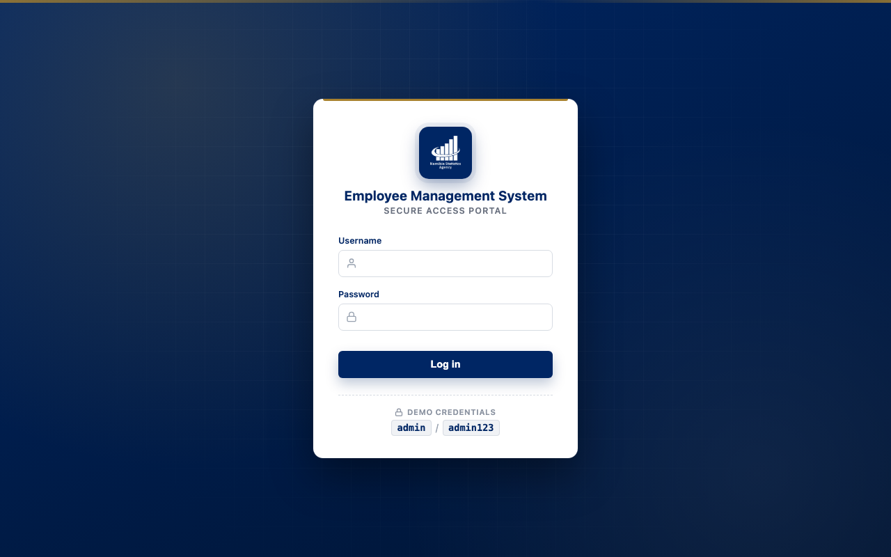
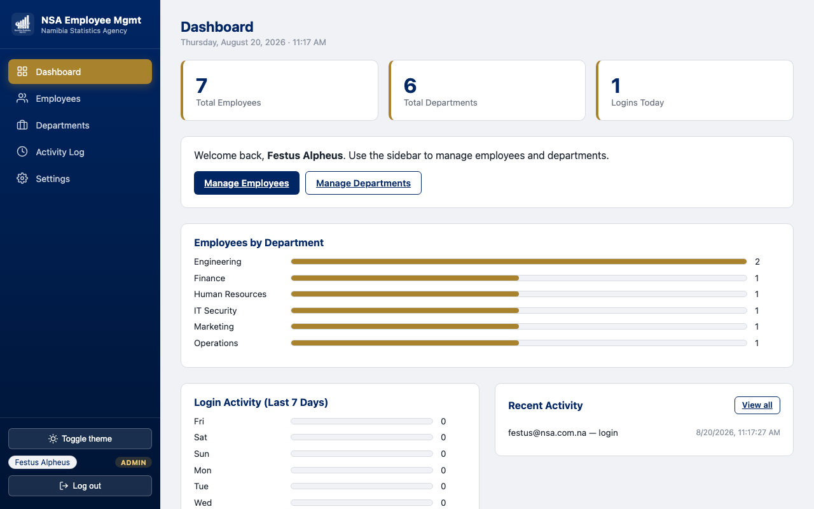
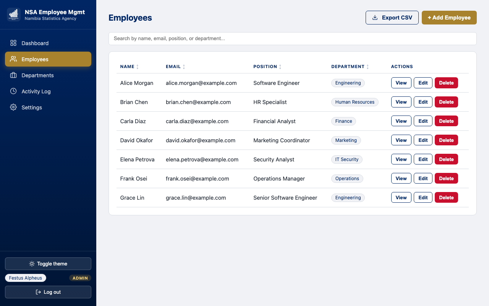
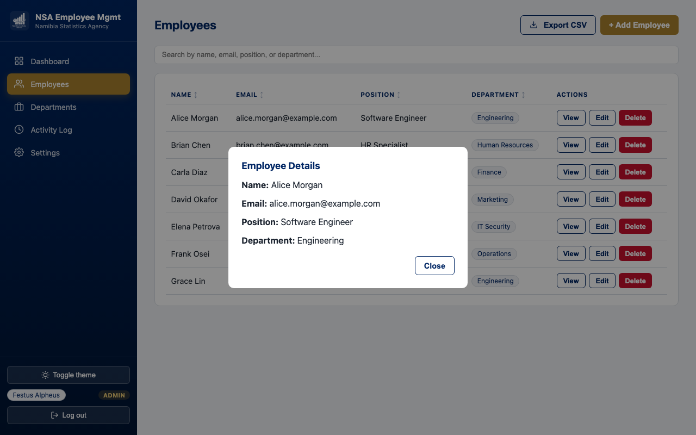
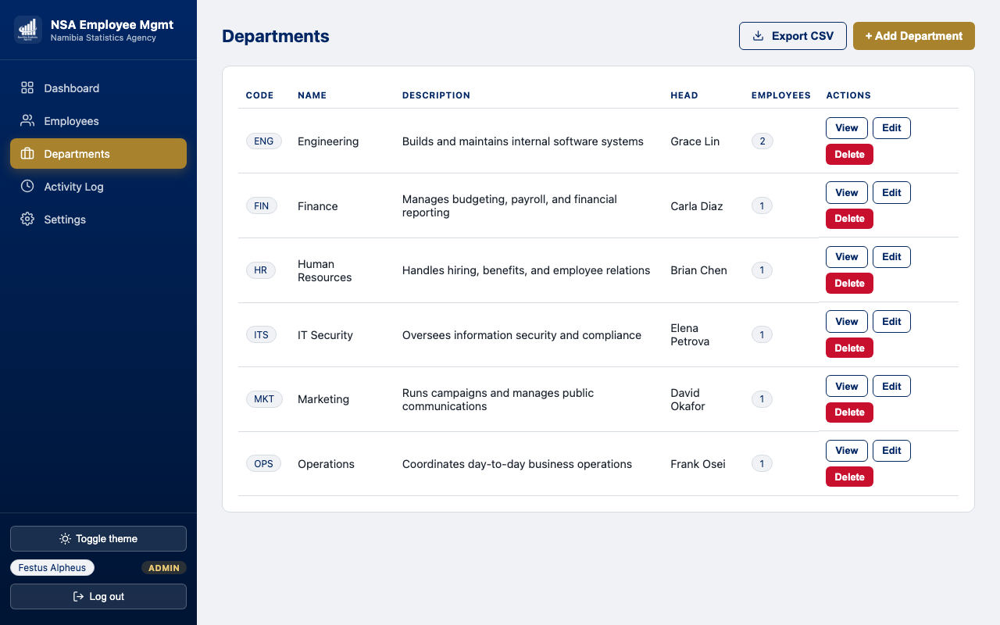
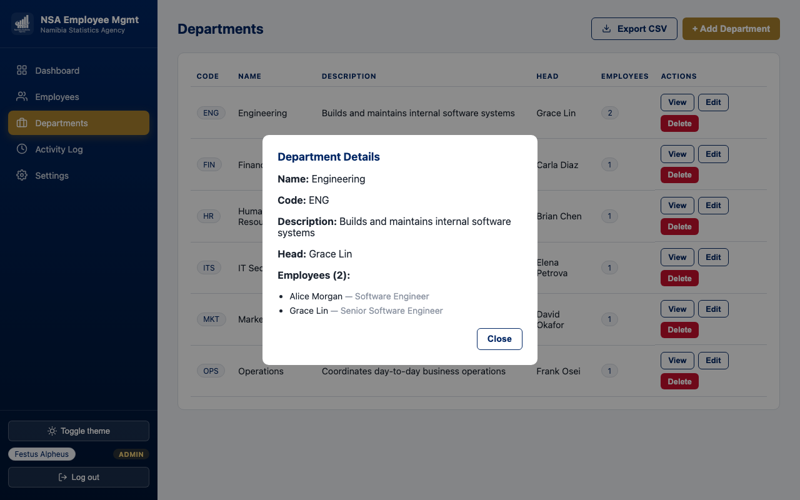
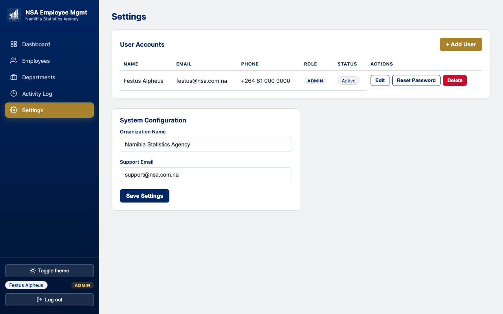
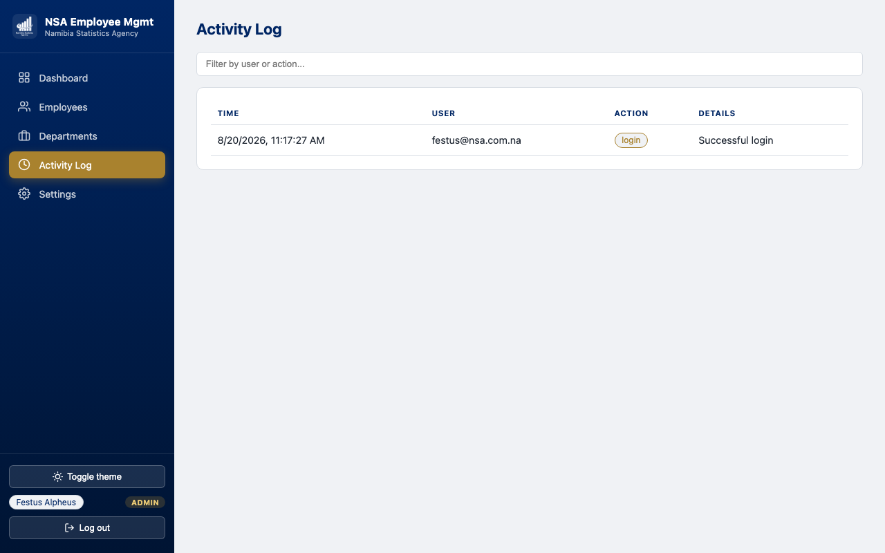
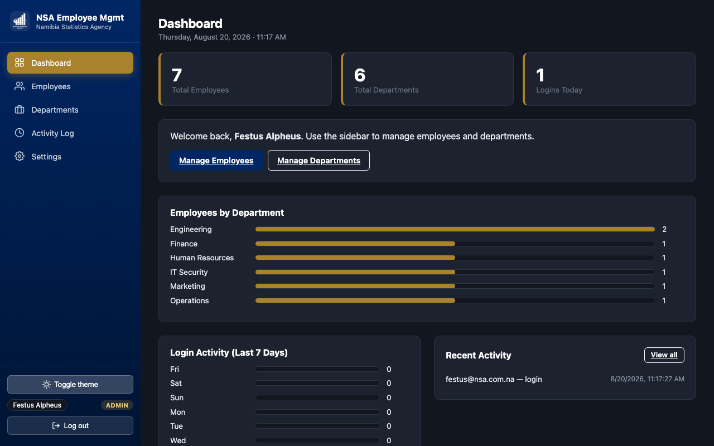
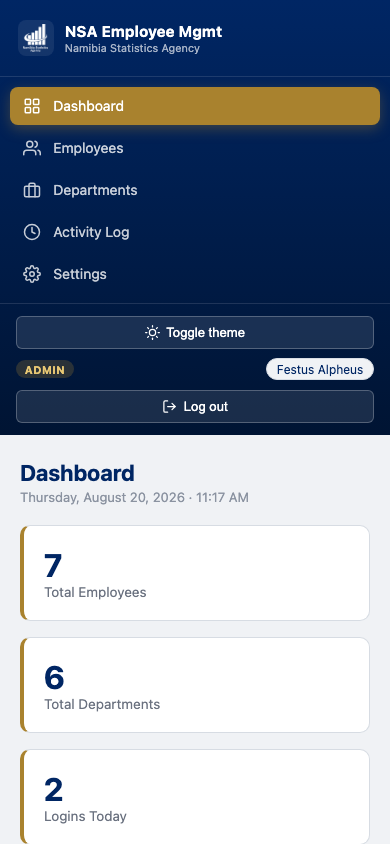

# NSA Employee Management System

An Employee Management System built for Section B (Practical) of the assessment: login, full Employee CRUD, full Department CRUD, a SQL database with proper foreign-key relationships, and a responsive UI matching the Namibia Statistics Agency (NSA) brand — extended with real account security (hashed passwords, login lockout, forgot/reset password), role-based access control, and a system-wide audit log.

## Screenshots

| Login | Dashboard |
|---|---|
|  |  |

| Employees | Employee detail |
|---|---|
|  |  |

| Departments | Department detail |
|---|---|
|  |  |

| Settings (Users + System Config) | Activity Log |
|---|---|
|  |  |

| Dark mode |
|---|
|  |

| Mobile / responsive |
|---|
|  |

## Section A

_Not included in this submission — the Section A question sheet was not available when this project was built. Please add your Section A answers to this section before submitting._

## Project Setup Steps

**Requirements:** Node.js 22+ (uses the built-in `node:sqlite` module — no separate database server to install).

```bash
npm install
npm start
```

Then open **http://localhost:3000** in your browser. The SQLite database (`ems.db`) is created and auto-seeded with sample departments/employees on first run.

To run the unit tests:

```bash
npm test
```

## Login Credentials

| Username or Email | Password | Role |
|---|---|---|
| `festus.alpheus` or `festus@nsa.com.na` | `NSA@2026` | Admin |

Login accepts **either** the username or the email — whichever is typed, as long as the password matches. The account is seeded into the `users` table with a salted `scrypt` password hash (see `lib/auth.js` / `db.js`) — the plaintext password is never stored. Additional accounts (with Admin/Support/Viewer roles) can be created from **Settings** once logged in.

## How to Use

1. **Log in** at `http://localhost:3000` with the credentials above (username or email both work). You're redirected to the dashboard on success.
   - **Forgot password?** requests a reset link — since no email service is configured in this demo, the link is shown directly on screen instead of being emailed (clearly labeled as dev-mode).
   - Five failed attempts on one account triggers a 15-minute lockout, with a support-email pointer shown in the error message.
   - **Terms of Use** is available from the login footer at any time.
   - Sessions **auto-expire after 20 minutes of inactivity** (both server-enforced and detected client-side), returning you to login with a clear explanation rather than a silent failure.
2. **Dashboard** shows total employee/department counts, a live date/time, and a bar-chart breakdown of employees per department. Admin and Support additionally see a **7-day login activity chart**, a **Recent Activity** feed, and a "Logins Today" stat card — all pulled from the same audit log as the Activity Log page.
3. **Employees** (left sidebar):
   - **+ Add Employee** opens a modal for name, email, position, and department. *(Admin/Support only.)*
   - Click any column header (Name, Email, Position, Department) to **sort** by it — click again to reverse the direction.
   - Use the **search box** to filter by name, email, position, or department in real time.
   - **View** opens a read-only detail card including the linked department. **Edit** reopens the same form pre-filled. **Delete** asks for confirmation, then removes the record. *(Edit/Delete: Admin/Support only.)*
   - **Export CSV** downloads the currently-filtered list as a `.csv` file.
4. **Departments** (left sidebar):
   - **+ Add Department** opens a modal for name, a short unique **code** (e.g. `ENG`, `FIN`), a description, and an optional **department head** (any employee). *(Admin/Support only.)*
   - **View** shows the department's code, description, head, and the full list of employees assigned to it.
   - **Delete** asks for confirmation and explains that linked employees are unassigned, not deleted, when a department is removed. *(Admin/Support only.)*
   - **Export CSV** downloads the department list (code, name, description, head, employee count).
   - Deleting an employee who is set as a department head automatically clears that department's head (rather than leaving a dangling reference) — covered by the browser-driven regression tests.
5. **Activity Log** (Admin/Support only) — a timestamped audit trail of every login, logout, failed login, and create/update/delete across employees, departments, and users. Filterable by a live search box.
6. **Settings** (Admin only):
   - **User Accounts** — add, edit, or remove login accounts, each with a first name, surname, email, phone number, and a role (Admin / Support / Viewer). New accounts require accepting the Terms of Use and a password meeting the complexity policy. **Reset Password** generates a fresh reset link for that user (same dev-mode display as the login page's forgot-password flow).
   - **System Configuration** — edit the organization name and support email shown across the app.
7. **Theme toggle** (bottom of sidebar) switches between light and dark mode; the choice is remembered across visits.
8. Every modal can be closed with its **Cancel/Close** button, the **Escape** key, or by clicking outside it on the backdrop.
9. **Log out** (bottom of sidebar) clears the session and returns to the login screen.

## Roles & Permissions

Enforced **server-side** on every request (not just hidden buttons in the UI) via a `requireRole()` middleware in `server.js`:

| Action | Admin | Support | Viewer |
|---|:---:|:---:|:---:|
| View dashboard, employees, departments | ✅ | ✅ | ✅ |
| Create/edit/delete employees & departments | ✅ | ✅ | ❌ |
| View Activity Log | ✅ | ✅ | ❌ |
| Manage users, view Settings | ✅ | ❌ | ❌ |

A Viewer who calls a write endpoint directly (bypassing the UI entirely) gets a `403` from the server, not just a hidden button — verified in manual testing by hitting the API directly with a viewer token.

## Tools Used

- **Node.js + Express** — server and REST API
- **SQLite** via Node's built-in `node:sqlite` module — no native compilation step, no external DB server required
- **Node's built-in `crypto`** (`scrypt` + `timingSafeEqual`) — salted password hashing, no external auth library
- **Vanilla HTML/CSS/JavaScript** — no frontend framework or build step, so the project runs immediately with zero build tooling
- **Playwright** (dev-time only, not a runtime dependency) — used during development to drive the real UI end-to-end (login, every CRUD flow, role boundaries, dark mode, mobile layout) and to capture the screenshots above
- **Node's built-in test runner** (`node:test`) — unit tests, no extra test framework dependency

## Assumptions Made

- "NSA" is the Namibia Statistics Agency, confirmed from the logo supplied (`NSA logo/white_nsa.webp`) and its real navy + gold brand colors. That logo is used directly in the sidebar and login screen; on the white login card it sits inside a navy badge so the white/transparent mark stays visible.
- The brand's actual accent color is **gold**, not red — red is reserved exclusively for destructive/warning actions (Delete buttons, error messages, lockout notices) so it reads as a semantic signal rather than a decorative color.
- **"Add users to the system" was built as admin-managed accounts, not public self-registration** — this is an internal tool, so an open sign-up page would be a security hole rather than a feature. Only an Admin can create accounts, from Settings.
- **Passwords are salted and hashed** with Node's built-in `crypto.scryptSync` (no plaintext storage, no external bcrypt dependency), and must satisfy a policy of at least 8 characters combining 3 of 4 character classes (upper/lower/digit/symbol) — the same standard Azure AD and most enterprise policies use. This was tuned specifically so the seeded password `NSA@2026` (which has no lowercase letter) still passes, rather than special-casing the seed account around a stricter rule.
- **Forgot password has no real email service behind it.** Rather than fake a "check your inbox" message that goes nowhere, the reset link is generated as a real, single-use, 30-minute-expiry token and displayed directly on screen, clearly labeled as dev-mode. The underlying flow (token generation, expiry, one-time use) is fully real; only the delivery channel is simulated.
- **Login lockout** is 5 failed attempts → 15-minute lock, tracked in memory (fine for a single-instance demo; would move to a shared store like Redis in a multi-instance deployment).
- **IP-based rate limiting** on `/api/login` (20 requests / 5 min) and `/api/forgot-password` (10 requests / 5 min) sits alongside the per-account lockout — the lockout alone doesn't stop someone spraying login attempts across *many different* accounts from one source; the rate limit does.
- **Sessions expire after 20 minutes of inactivity** (a sliding window — any authenticated request extends it), enforced server-side in `requireAuth` and mirrored client-side by an idle-activity timer, so an unattended browser tab can't stay logged in indefinitely.
- Login uses a bearer-token session (kept in `localStorage`), sufficient for a single-instance demo app, not a production auth scheme (no refresh tokens, no CSRF protections needed since there are no cookies).
- The login screen is a split-screen layout (branded static panel + form), deliberately without decorative animation — a bouncing/floating background reads as a demo toy rather than the enterprise system this is meant to look like.
- Departments and employees are seeded with realistic simulation data (6 departments, 7 employees) per "create random departments for simulation."
- Deleting a department unassigns (rather than deletes) any employees linked to it, to avoid silent data loss — this is exercised directly in the unit tests.
- Navigation is a left sidebar (collapsing to a horizontal bar on tablet, and stacking on mobile) rather than a top bar, matching common admin-dashboard conventions and leaving more horizontal room for data tables.
- Redis was deliberately skipped: it isn't installed in this environment, and adding it would turn `npm install && npm start` into a multi-service setup for a dataset this small — a worse trade for a reviewer trying to run the project quickly than the bonus marks are worth. Login-attempt tracking and sessions use in-memory `Map`s instead, which cover the same ground for a single-instance demo.

## Bonus Features Implemented

- ✅ **REST API architecture** — `/api/employees`, `/api/departments`, `/api/users`, `/api/settings`, `/api/activity-log` with proper HTTP verbs (GET/POST/PUT/DELETE) and status codes; see `server.js`.
- ✅ **Search/filtering** — live search on the Employees list and the Activity Log.
- ✅ **Dark/light theme toggle** — sidebar button, persisted in `localStorage`, full dark-mode CSS variables across every page and modal.
- ✅ **Unit tests for one feature** — `test/employees.test.js` (employee CRUD + department-delete unassign behavior) and `test/auth.test.js` (password hashing, password policy, email validation) using Node's built-in test runner (`npm test`).
- ⬜ Redis — see Assumptions above.

## Extra Polish (beyond the marked criteria)

- **Role-based access control** — Admin / Support / Viewer, enforced server-side (see Roles & Permissions above), not just hidden UI.
- **Real account security** — salted+hashed passwords, a password complexity policy, login-attempt lockout, and a real (if dev-mode-delivered) forgot/reset-password flow with single-use expiring tokens.
- **System-wide activity log** — every login, logout, failed login, and CRUD action is recorded with who/what/when.
- **User management** — admin-managed accounts with first name, surname, email, phone, and role.
- **Idle-session timeout** — 20-minute sliding-window auto logout, enforced server-side and mirrored client-side, with a clear on-screen explanation rather than a silent failure.
- **IP-based rate limiting** on the login and forgot-password endpoints, independent of the per-account lockout (see Assumptions).
- **`/api/health` endpoint** — status, uptime, and timestamp, the standard shape a load balancer or uptime monitor expects.
- **Department code + department head** — short unique codes (`ENG`, `FIN`, …) and an assignable head from the employee list; deleting that employee automatically clears the headship rather than leaving a dangling reference.
- **Dashboard activity widgets** (Admin/Support) — live date/time, a 7-day login-activity chart, a Recent Activity feed, and a "Logins Today" stat, all reusing the audit log.
- **CSV export** for both the Employees and Departments tables (Employees respects the current search filter).
- **Sortable employee table** — click any column header to sort, click again to reverse.
- **Department detail view** — see every employee assigned to a department, not just the count.
- **Custom confirm dialogs and toast notifications** in place of the browser's native `confirm()`/`alert()`, matching the app's own design language.
- **Modal dismissal via Escape key, backdrop click, or any Close/Cancel button** — handled by one generic mechanism in `common.js` so it's consistent everywhere.
- **Dashboard breakdown chart** — employees-per-department bar chart, not just raw counts.
- Responsive sidebar with two breakpoints (tablet: sidebar becomes a horizontal bar; mobile: it stacks vertically).

## Requirement Coverage

| Criteria | Marks | Notes |
|---|---|---|
| Functional Login | 10 | Hashed-password check, lockout, forgot/reset password, token session, redirect to dashboard |
| Employee CRUD | 25 | List/add/edit/delete + sort + search + detail view showing linked department |
| Department CRUD | 20 | List/add/edit/delete + code + head + detail view of assigned employees, FK-linked to employees |
| Database & Relationships | 10 | SQLite, `employees.department_id` FK → `departments.id`, `ON DELETE SET NULL` |
| Design/Usability | 5 | NSA navy/gold palette, responsive sidebar layout, logo in sidebar + login |
| Bonus | up to 10 | REST API, search/filter, theme toggle, unit tests |

## Project Structure

```
server.js                 Express app + REST API routes, role middleware, activity logging,
                           rate limiting, health check
db.js                      SQLite schema + seed data (departments now include code + head)
lib/auth.js                Password hashing (scrypt), complexity policy, username/email validation
lib/session.js             Idle-session-expiry logic (pure function, unit tested)
lib/rateLimit.js           Sliding-window rate-limit logic (pure function, unit tested)
public/
  index.html               Login — split-screen enterprise layout, username-or-email,
                            forgot/reset password, Terms of Use
  dashboard.html            Dashboard — stats, live clock, department breakdown,
                            login-activity chart + recent-activity feed (admin/support)
  employees.html + js/employees.js       Employee CRUD UI (sort, search, CSV export)
  departments.html + js/departments.js    Department CRUD UI (with employee-list detail view)
  settings.html + js/settings.js          User accounts + system configuration (admin only)
  activity-log.html + js/activity-log.js  Audit trail viewer (admin/support only)
  js/common.js              Sidebar render, auth/role guards, API client, theme toggle,
                             toast notifications, custom confirm dialog, CSV export,
                             modal dismissal (Escape/backdrop/close-button), sortable-table
                             helper, idle-timeout auto logout
  css/style.css             NSA palette, sidebar layout, responsive + dark-mode styles
  assets/nsa-logo.webp      Provided NSA logo asset
docs/screenshots/          Screenshots used in this README
test/employees.test.js     Unit tests — employee CRUD, department FK behavior
test/auth.test.js          Unit tests — password hashing, complexity policy, email validation
test/session.test.js       Unit tests — idle-session-expiry logic
test/rateLimit.test.js     Unit tests — sliding-window rate-limit logic
```
